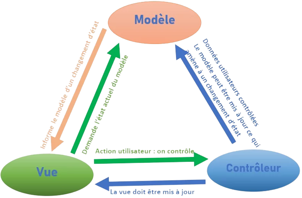

Model View Controller 

Modèle-vue-contrôleur ou MVC est un motif d'architecture logicielle destiné aux interfaces graphiques. Le motif est composé de trois types de modules ayant trois responsabilités différentes : les modèles, les vues et les contrôleurs.
-Un modèle (Model) contient les données à afficher.
-Une vue (View) contient la présentation de l'interface graphique.
-Un contrôleur (Controller) contient la logique concernant les actions effectuées par l'utilisateur.

Design pattern (= motif de conception d'architecture logicielle)
Objectif : séparation des données, des traitements et de la présentation